# Znaki drogowe do nauki

## Informacyjne

| Znak | Nazwa |
|------|-------|
| 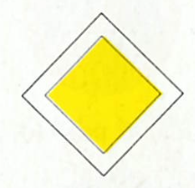 | Droga z pierwszeństwem |
| 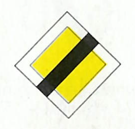 | Koniec drogi z pierwszeństwem |
| 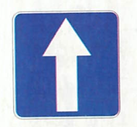 | Droga jednokierunkowa |
| 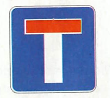 | Droga bez przejazdu |
| 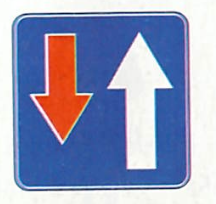 | Pierwszeństwo na zwężonym odcinku jezdni |
| 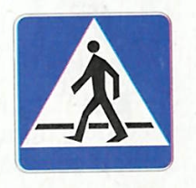 | Przejście dla pieszych |
| 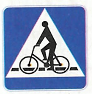 | Przejazd dla rowerzystów |
| 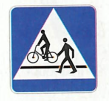 | Przejście dla pieszych i przejazd dla rowerzystów |
| 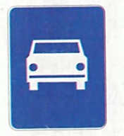 | Droga ekspresowa |
| 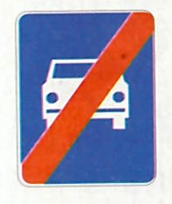 | Koniec drogi ekspresowej |
| 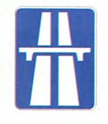 | Autostrada |
| 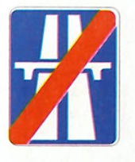 | Koniec autostrady |
| 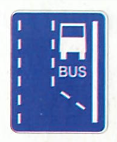 | Początek pasa ruchu dla autobusów |
| 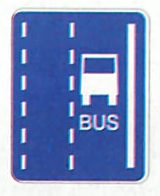 | Pas ruchu dla autobusów |
| 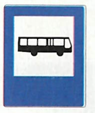 | Przystanek autobusowy |
| 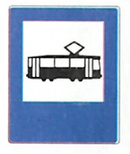 | Przystanek tramwajowy |
| 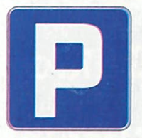 | Parking |
| 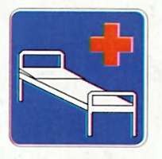 | Szpital |
| 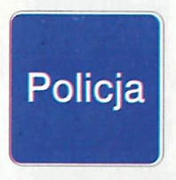 | Policja |
| 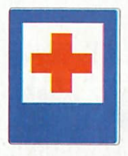 | Punkt opatrunkowy |
| 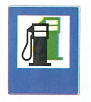 | Stacja paliwowa |
| 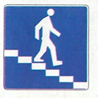 | Przejście podziemne dla pieszych |
| 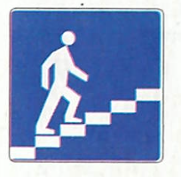 | Przejście nadziemne dla pieszych |
| 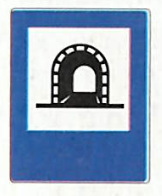 | Tunel |
| 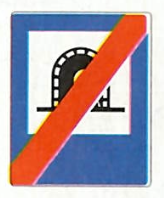 | Koniec tunelu |
| 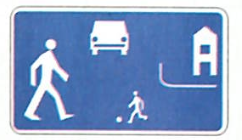 | Strefa zamieszkania |
| 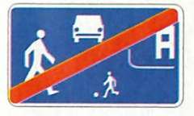 | Koniec strefy zamieszkania |
| 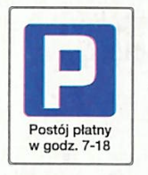 | Strefa parkowania |
| 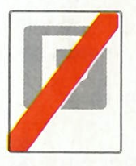 | Koniec strefy parkowania |
| 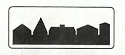 | Obszar zabudowany |
| 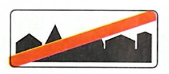 | Koniec obszaru zabudowanego |
| 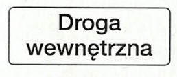 | Droga wewnętrzna |
| 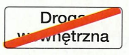 | Koniec drogi wewnętrznej |
| 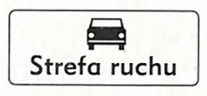 | Strefa ruchu |
| 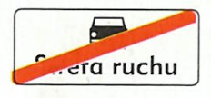 | Koniec strefy ruchu |

## Kierunku i miejscowosci

| Znak | Nazwa |
|------|-------|
| 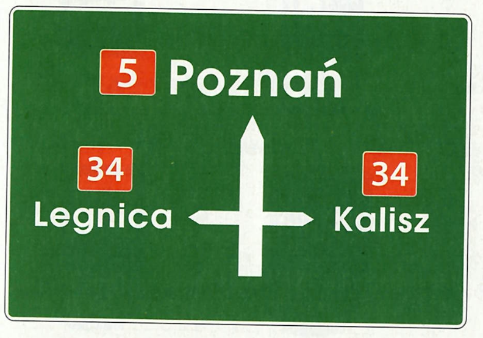 | Tablica przeddrogowskazowa |
| 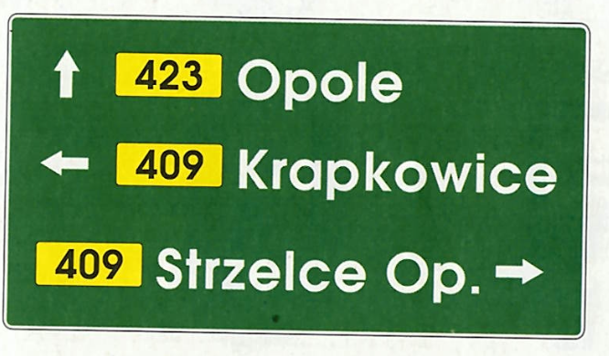 | Drogowskaz tablicowy umieszczany obok jezdni |
| 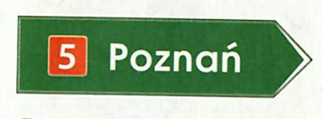 | Drogowskaz w kształcie strzały do miejscowości wskazujący numer drogi |
| 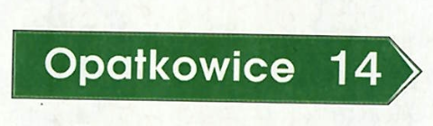 | Drogowskaz w kształcie strzały do miejscowości podający do niej odległość |
| 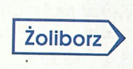 | Drogowskaz do dzielnicy miasta |
| 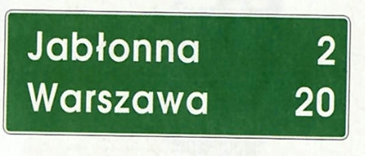 | Tablica kierunkowa |
| 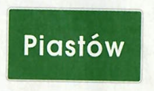 | Miejscowość |
| 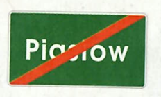 | Koniec miejscowości |
| 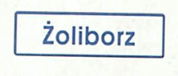 | Dzielnica (osiedle) |

## Nakazu

| Znak | Nazwa |
|------|-------|
| 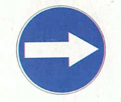 | Nakaz jazdy w prawo przed znakiem |
| 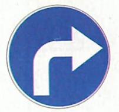 | Nakaz jazdy w prawo za znakiem |
| 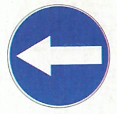 | Nakaz jazdy w lewo za znakiem przed znakiem |
| 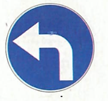 | Nakaz jazdy w lewo za znakiem |
| 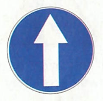 | Nakaz jazdy prosto |
| 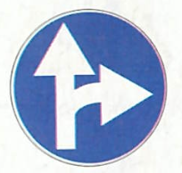 | Nakaz jazdy prosto lub w prawo |
|  | Nakaz jazdy prosto lub w lewo |
|  | Nakaz jazdy w prawo lub w lewo |
|  | Nakaz jazdy z prawej strony znaku |
|  | Nakaz jazdy z lewej strony znaku |
|  | Nakaz jazdy z prawej lub lewej strony znaku |
|  | Ruch okrężny |
|  | Droga dla rowerów |
|  | Koniec drogi dla rowerów |
|  | Prędkość minimalna |
|  | Koniec prędkości minimalnej |
|  | Droga dla pieszych |
|  | Koniec drogi dla pieszych |

## Ostrzegawcze

| Znak | Nazwa |
|------|-------|
|  | Niebezpieczny zakręt w prawo |
|  | Niebezpieczny zakręt w lewo |
|  | Niebezpieczne zakręty - pierwszy w prawo |
|  | Niebezpieczne zakręty - pierwszy w lewo |
|  | Skrzyżowanie dróg |
|  | Skrzyżowanie z drogą podporządkowaną występującą po obu stronach |
|  | Skrzyżowanie z drogą podporządkowaną występującą po prawej stronie |
|  | Skrzyżowanie z drogą podporządkowaną występującą po lewej stronie |
|  | Wlot drogi jednokierunkowej z prawej strony |
|  | Wlot drogi jednokierunkowej z lewej strony |
|  | Ustąp pierwszeństwa |
|  | Skrzyżowanie o ruchu okrężnym |
|  | Przejazd kolejowy z zaporami |
|  | Przejazd kolejowy bez zapór |
|  | Nierówna droga |
|  | Próg zwalniający |
|  | Zwężenie jezdni - dwustronne |
|  | Zwężenie jezdni - prawostronne |
|  | Zwężenie jezdni - lewostronne |
|  | Roboty na drodze |
|  | Śliska jezdnia |
|  | Przejście dla pieszych |
|  | Dzieci |
|  | Zwierzęta gospodarskie |
|  | Zwierzęta dzikie |
|  | Odcinek jezdni o ruchu dwukierunkowym |
|  | Tramwaj |
|  | Niebezpieczny zjazd |
|  | Stromy podjazd |
|  | Rowerzyści |
|  | Nabrzeże lub brzeg rzeki |
|  | Sygnały świetlne |
|  | Inne niebezpieczeństwo |
|  | Niebezpieczne pobocze |
|  | Oszronienie jezdni |

## Poziome

| Znak | Nazwa |
|------|-------|
|  | Linia pojedyncza przerywana |
|  | Linia pojedyncza ciągła |
|  | Linia jednostronnie przekraczalna |
|  | Linia podwójna ciągła |
|  | Linia podwójna przerywana |
|  | Linia ostrzegawcza |
|  | Linia krawędziowa przerywana |
|  | Linia krawędziowa ciągła |
|  | Strzałka kierunkowa na wprost |
|  | Strzałka kierunkowa do skręcania |
|  | Strzałka kierunkowa do zawracania |
|  | Strzałka naprowadzająca |
|  | Przejście dla pieszych |
|  | Przejazd dla rowerzystów |
|  | Linia bezwzględnego zatrzymania - stop |
|  | Linia warunkowego zatrzymania złożona z trójkątów |
|  | Linia warunkowego zatrzymania złożona z prostokątów |
|  | Trójkąt podporządkowania |
|  | Napis stop |
|  | Powierzchnia wyłączona |
|  | BUS |
|  | Rower |
|  | Miejsce dla pojazdu osoby niepełnosprawnej |

## Przed przejazdami kolejowymi

| Znak | Nazwa |
|------|-------|
|  | Słupek wskaźnikowy z trzema kreskami |
|  | Słupek wskaźnikowy z dwiema kreskami |
|  | Słupek wskaźnikowy z jedną kreską |
|  | Krzyż św. Andrzeja przed przejazdem kolejowym jednotorowym |
|  | Krzyż św. Andrzeja przed przejazdem kolejowym wielotorowym |

## Sygnaly swietlne

| Znak | Nazwa |
|------|-------|
|  | Sygnalizator z sygnałami do kierowania ruchem |
|  | Sygnalizator z sygnałami dopuszczającym skręcanie w kierunku wskazanym strzałką |
|  | Sygnalizator kierunkowy |
|  | Sygnalizator z sygnałami dla pieszych |
|  | Sygnalizator z sygnałami dla rowerzystów |

## Szlaki rowerowe

| Znak | Nazwa |
|------|-------|
|  | Szlak rowerowy lokalny |
|  | Początek (koniec) szlaku rowerowego lokalnego |
|  | Zmiana kierunku szlaku rowerowego lokalnego |
|  | Tablica szlaku rowerowego |

## Tabliczki do znakow

| Znak | Nazwa |
|------|-------|
|  | Odległość znaku ostrzegawczego od miejsca niebezpiecznego |
|  | Długość odcinka drogi, na którym powtarza się lub występuje niebezpieczeństwo |
|  | Koniec odcinka, na którym powtarza się lub występuje niebezpieczeństwo |
|  | Liczba zakrętów |
|  | Początek drogi krętej |
|  | Przebieg drogi z pierwszeństwem przez skrzyżowanie |
|  | Układ dróg podporządkowanych |
|  | Prostopadły przebieg drogi z pierwszeństwem i układ dróg podporządkowanych |
|  | Miejsce częstych wypadków |
|  | Miejsce wyjazdu pojazdów uprzywilejowanych |
|  | Długość odcinka jezdni, na którym zakaz obowiązuje |
|  | Odległość znaku od miejsca, od którego lub w którym zakaz obowiązuje |
|  | Początek zakazu postoju lub zatrzymywania |
|  | Kontynuacja zakazu postoju lub zatrzymywania |
|  | Odwołanie zakazu postoju lub zatrzymywania |
|  | Przejście dla pieszych szczególnie uczęszczane przez dzieci (Agatka) |

## Uzupelniajace

| Znak | Nazwa |
|------|-------|
|  | Sposób jazdy w związku z zakazem skręcania w lewo |
|  | Ruch skierowany na sąsiednią jezdnię |
|  | Kierunki na pasach ruchu |
|  | Niesymetryczny podział jezdni dla przeciwległych kierunków ruchu |
|  | Koniec pasa ruchu na jezdni dwukierunkowej |
|  | Pas ruchu dla określonych pojazdów |

## Zakazu

| Znak | Nazwa |
|------|-------|
|  | Zakaz ruchu w obu kierunkach |
|  | Zakaz wjazdu |
|  | Zakaz wjazdu rowerów |
|  | Zakaz wjazdu wózków rowerowych |
|  | Stop |
|  | Zakaz skręcania w lewo |
|  | Zakaz skręcania w prawo |
|  | Zakaz zawracania |
|  | Koniec zakazu zawracania |
|  | Zakaz używania sygnałów dźwiękowych |
|  | Koniec zakazu używania sygnałów dźwiękowych |
|  | Pierwszeństwo dla nadjeżdżających z przeciwka |
|  | Ograniczenie prędkości |
|  | Koniec ograniczenia prędkości |
|  | Zakaz postoju |
|  | Zakaz zatrzymywania się |
|  | Zakaz ruchu pieszych |
|  | Koniec zakazów |
|  | Strefa ograniczonej prędkości |
|  | Koniec strefy ograniczonej prędkości |
